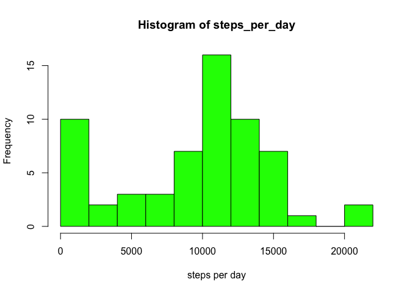
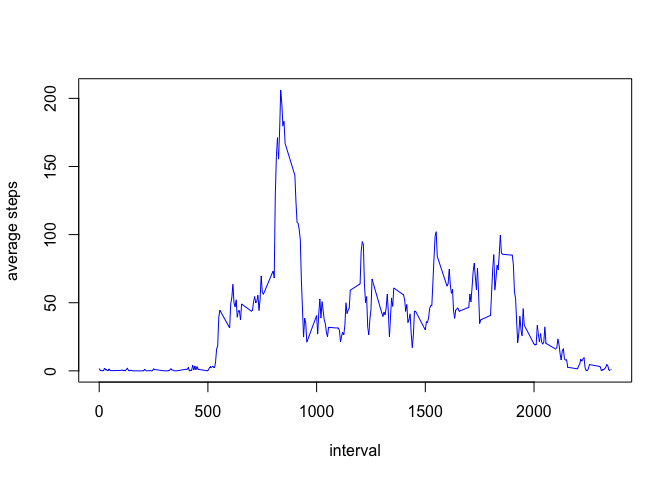
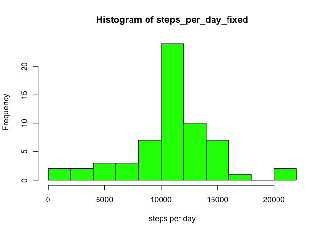
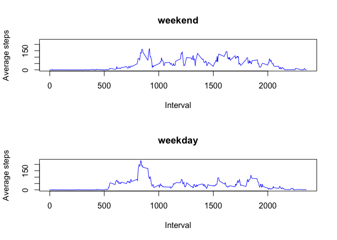

# Reproducible Research: Peer Assessment 1


This is the [first assignment for the Reproducible Research course](https://www.coursera.org/learn/reproducible-research/peer/gYyPt/course-project-1) at [Coursera](https://www.coursera.org).

The code should be run at the root of this project as working directory. 

## Loading and preprocessing the data

**1. Load the data (i.e. read.csv())**

First, we will unzip the data files and read its CSV content.


```r
if (!file.exists("activity.csv")) { unzip("activity.zip") }
data <- read.csv("activity.csv")
```

**2. Process/transform the data (if necessary) into a format suitable for your analysis**

I did no transformation/preprocessing at this step. All data processing was carried out at the step when it was needed.

## What is mean total number of steps taken per day?

**1. Calculate the total number of steps taken per day**

As a first step, we will compute the number of steps for each day, ignoring missing values.


```r
steps_per_day <- tapply(data$steps, data["date"], sum, na.rm=TRUE)
```
**2. If you do not understand the difference between a histogram and a barplot, research the difference between them. Make a histogram of the total number of steps taken each day**

Let's take a look at a histogram of total steps per day:


```r
hist(steps_per_day, col="green", breaks=10, xlab="Steps per day", main="Total number of steps per day")
```

<!-- -->

**3. Calculate and report the mean and median of the total number of steps taken per day **

Computing the mean of steps per day:


```r
mean(steps_per_day, na.rm=TRUE)
```

```
## [1] 9354.23
```

Computing the median of steps per day:


```r
median(steps_per_day, na.rm=TRUE)
```

```
## [1] 10395
```

## What is the average daily activity pattern?

**1. Make a time series plot (i.e. type = "l") of the 5-minute interval (x-axis) and the average number of steps taken, averaged across all days (y-axis)**

We first compute the average number of steps for each interval. Then we plot this data. 


```r
avg_steps_per_interval <- tapply(data$steps, data$interval, mean, na.rm=TRUE)
plot(names(avg_steps_per_interval), avg_steps_per_interval, type="l", xlab="Interval", ylab="Average steps", col="blue")
```

<!-- -->

**2. Which 5-minute interval, on average across all the days in the dataset, contains the maximum number of steps?**

The 5 minute interval wich has the maximum average number of steps is shown bellow:


```r
names(which.max(avg_steps_per_interval))
```

```
## [1] "835"
```

## Imputing missing values

**1. Calculate and report the total number of missing values in the dataset (i.e. the total number of rows with NAs) **

Let's check the number of NAs for each column in our dataset.

We have some missing values in our steps field:


```r
sum(is.na(data$steps))
```

```
## [1] 2304
```

But no missing values in date or interval fields:


```r
sum(is.na(data$date))
```

```
## [1] 0
```


```r
sum(is.na(data$interval))
```

```
## [1] 0
```

**2. Devise a strategy for filling in all of the missing values in the dataset. The strategy does not need to be sophisticated. For example, you could use the mean/median for that day, or the mean for that 5-minute interval, etc. **

We will impute the missing values with the mean value for the 5 minute interval as we computed in previous steps.

**3.  a new dataset that is equal to the original dataset but with the missing data filled in. **

In this step we create a new field with the missing values replaced by the average number of steps for that 5 minute interval.


```r
data$steps_fixed <- ifelse(is.na(data$steps), avg_steps_per_interval[as.character(data$interval)], data$steps)
```

**4. Make a histogram of the total number of steps taken each day and Calculate and report the mean and median total number of steps taken per day. Do these values differ from the estimates from the first part of the assignment? What is the impact of imputing missing data on the estimates of the total daily number of steps? **

To compare with the original dataset, we will plot a histogram and compute mean and median values for the new field without missing values. First we plot the histogram:


```r
steps_per_day_fixed <- tapply(data$steps_fixed, data["date"], sum)
hist(steps_per_day_fixed, col="green", breaks=10, xlab="Steps per day")
```

<!-- -->

Computing the mean of steps per day:


```r
mean(steps_per_day_fixed)
```

```
## [1] 10766.19
```

Computing the median of steps per day:


```r
median(steps_per_day_fixed)
```

```
## [1] 10766.19
```

## Are there differences in activity patterns between weekdays and weekends?

**1. Create a new factor variable in the dataset with two levels – “weekday” and “weekend” indicating whether a given date is a weekday or weekend day.** 

We create a new factor variable in our dataset, checking if the date field is on a weekend or weekday.


```r
data$day_type <- factor(ifelse(weekdays(as.Date(data$date)) %in% c("Sunday", "Saturday"), "weekend", "weekday"))
```

**2. Make a panel plot containing a time series plot (i.e. type = "l") of the 5-minute interval (x-axis) and the average number of steps taken, averaged across all weekday days or weekend days (y-axis). See the README file in the GitHub repository to see an example of what this plot should look like using simulated data. **

To compare activity pattern between weekends and weekdays, we will plot two time series after splitting the dataset between weekend and weekday.


```r
data_splitted <- split(data, data$day_type)
steps_weekend <- tapply(data_splitted$weekend$steps_fixed, data_splitted$weekend$interval, mean)
steps_weekday <- tapply(data_splitted$weekday$steps_fixed, data_splitted$weekday$interval, mean)
par(mfrow=c(2,1))
y_limits <- c(min(steps_weekend, steps_weekday), c(max(steps_weekend, steps_weekday)))
plot(names(steps_weekend), steps_weekend, type="l", xlab="Interval", ylab="Average steps", col="blue", main="weekend", ylim=y_limits)
plot(names(steps_weekday), steps_weekday, type="l", xlab="Interval", ylab="Average steps", col="blue", main="weekday", ylim=y_limits)
```

<!-- -->
